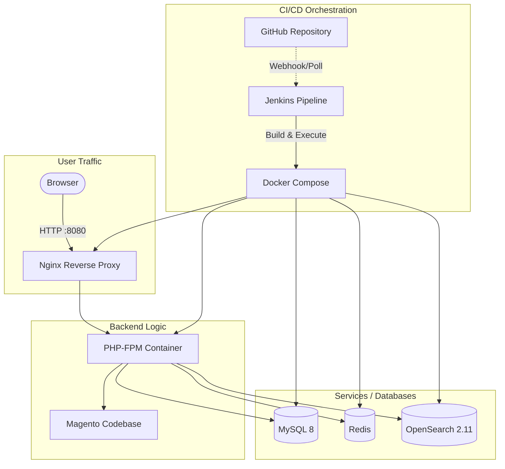

# Fully Automated CI/CD Pipeline for Magento using Docker and Jenkins

This project embodies a fully automated CI/CD pipeline for deploying a Magento e-commerce application. The setup provisions a robust, multi-service architecture using Docker Compose while automating the entire workflow—from code extraction to final deployment—via Jenkins. 

## 🏗️ Architecture Flow



## 🛠️ Tech Stack & Services

*   **Magento**: Enterprise e-commerce framework.
*   **Jenkins**: Automation server handling the CI/CD pipeline logic.
*   **Docker & Docker Compose**: Containerization and service orchestration.
*   **Nginx**: Web server serving frontend requests.
*   **PHP-FPM**: Application server executing Magento logic.
*   **MySQL 8**: Primary relational database.
*   **Redis**: In-memory data structure store for caching and session management.
*   **OpenSearch 2.11**: Powerful, scalable search engine for the Magento catalog.

## 🚀 Jenkins Pipeline Workflow

The pipeline (`Jenkinsfile`) automates deployments with **zero manual intervention**, proceeding through the following critical stages:

1.  **Checkout Code**: Pulls the `main` branch from the GitHub repository.
2.  **Cleanup**: Removes old/stale Magento containers to prevent overlapping states.
3.  **Start Containers**: Provisions the cluster using `docker compose up -d --build`.
4.  **Copy Magento Code**: Safely transfers the application code into the PHP container.
5.  **Setup Auth.json**: Securely injects Composer credentials for private Magento and Mageplaza repositories using Jenkins Credential bindings.
6.  **Dependency Wait**: Implements self-healing health checks to wait for MySQL and OpenSearch to boot up and start accepting connections.
7.  **Composer Install**: Resolves and installs PHP dependencies via Composer.
8.  **Fix Permissions**: Applies the necessary read/write permissions for Magento to function properly (`var`, `generated`, `pub/static`, etc.).
9.  **Magento Install**: Bootstraps the Magento application, explicitly configuring the DB, OpenSearch, admin user, and base URLs.
10. **Deploy & Verify**: Runs database upgrades (`setup:upgrade`), flushes the cache, and verifies container health.

## 🛡️ DevOps Challenges Handled

*   **Container Networking**: Orchestrated seamless inter-service communication across Nginx, DB, Redis, and OpenSearch within virtual Docker networks.
*   **Private Repository Authentication**: Prevented plain-text credential leaks by dynamically generating `auth.json` inside the container using Jenkins masked variables.
*   **Container Race Conditions**: Built logical bash retry blocks (`until` loops) for slow-starting services like MySQL and OpenSearch, ensuring Magento installation doesn't fail prematurely.
*   **Idempotent Deployments**: Handled runtime verification (like checking if `env.php` exists) to intelligently skip repeated and destructive full reinstalls when running the pipeline consecutively.

## ⚙️ Local Usage

To start this stack locally without Jenkins, run:

```bash
docker compose up -d --build
```

Wait a few moments for the database and search engine to boot, then access the application at:
**`http://localhost:8080`**
